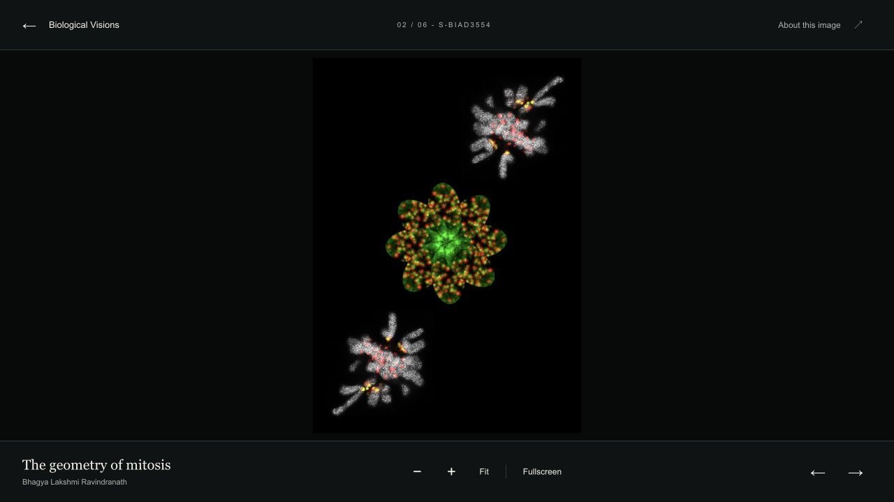
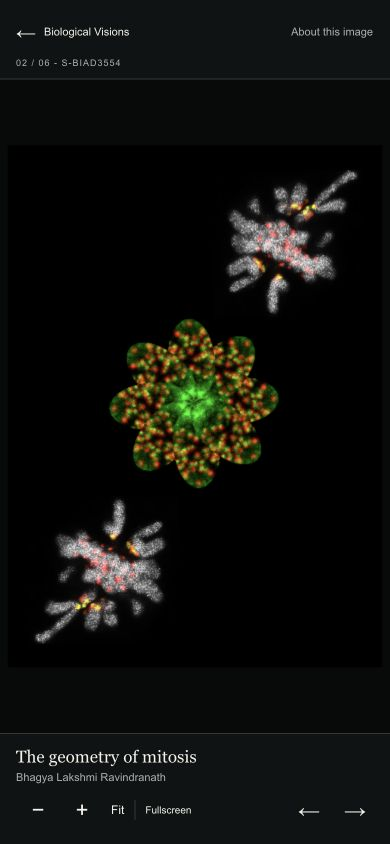

# Biological Visions gallery

The gallery is `/bioimage-archive/galleries/biological-visions`; each artwork opens a dedicated full-screen layout with an embedded 2D viewer. The six entries use live API identities and public OME-Zarrs/previews. The gallery and viewer display accession IDs. The dark artwork layout and large, natural-aspect previews are separate from standard scientific study presentation.

## Content

Edit `src/data/collections/biological-visions-selection.json` for order, title, creator, affiliation, caption, alt text and award information. The exporter combines this editorial selection with live API descriptions, licences, image dimensions and published preview/viewer URLs:

```sh
BIA_COLLECTION_API=https://wwwdev.ebi.ac.uk/bioimage-archive/api node scripts/export-biological-visions.mjs
```

Review and commit the resulting `biological-visions.json` and gallery index changes. This is an explicit maintainer operation; deployment does not regenerate editorial content or need write access to the API. The About dialog uses the generated collection record.

## Viewer bundle

`public/biological-visions-viewer/` contains the successful CI artifact from the private BioImage-Archive/vizarr repository, together with the upstream MIT licence. `build-manifest.json` pins the exact build revision, merged revision, CI run and SHA-256 of each file. All assets, including codec chunks, must be retained. No private-repository credentials are needed to build or serve Astro.

```sh
node scripts/verify-biological-visions-viewer.mjs
```

To update, download the `bia-gallery-viewer` artifact from a passing, reviewed Vizarr revision using an authenticated maintainer account. Replace the bundle directory, preserve the MIT licence, and regenerate the revision/hash manifest. Verify the hashes and run the full Astro build before review.

Astro and the iframe must share an origin. The parent handles fit/zoom, fullscreen, navigation, About, and static fallback/retry. A WebGL/source failure leaves the artwork preview available; failure of both displays descriptive text and Retry. Existing dataset hero previews link through the standard study/image routes.

## Validation and deployment

Run `npm ci`, the viewer checksum verifier, and `npm run build` with the normal live API settings. For a local production preview use the built Node server on a free port. Check all six artwork pages, decoded preview images, interactive loading, About/licence/accession, previous/next wraparound, and mobile layout. Physical touch and a second browser engine remain acceptance items.

The normal Netlify preview/deployment serves this gallery and the viewer together. No new storage service, API mutation or runtime secret is required. Reverting this gallery change removes its navigation/pages while retaining the already-published scientific data.

## Release checks

The initial full production build passed (114 files checked, zero errors/warnings). The six studies were then incrementally indexed so collection-record links resolve in the next build. Index totals increased by exactly six studies and seven submitted images, with no deletions. Screenshots from the built site using the public image stores:




